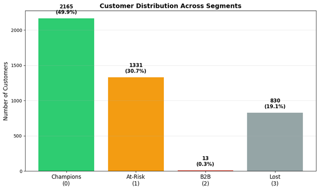
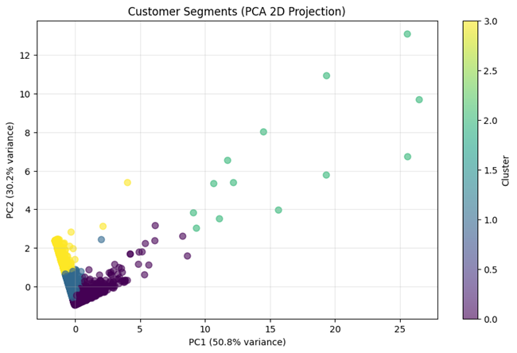

# Customer Segmentation using RFM Analysis & K-Means Clustering


## Project Overview

This project segments 4,339 online retail customers using **RFM (Recency, Frequency, Monetary)** analysis and **K-means clustering** to enable targeted marketing strategies. The analysis identified **4 distinct customer segments** with **$360K-480K projected revenue recovery potential** through segment-specific campaigns.

**Key Achievement:** Transformed 541,909 transactions into actionable business insights with clear ROI projections.

---

## Business Impact

| Metric | Result |
|--------|--------|
| **Customers Analyzed** | 4,339 unique customers |
| **Revenue Recovery Potential** | $360K - $480K (estimated) |
| **At-Risk Customers Identified** | 1,331 (30.7%) requiring immediate intervention |
| **B2B High-Value Accounts** | 13 customers generating 30-40% of revenue |
| **Segments Created** | 4 actionable groups with tailored strategies |

---

## Key Findings

### Customer Segments Identified:

**1. Champions (49.9%, 2,165 customers)**
- Average spend: $4,238 | Frequency: 135 purchases | Recency: 21 days
- *Action:* VIP loyalty program, early product access, referral incentives
- *Projected outcome:* 15-20% increase in lifetime value

**2. At-Risk (30.7%, 1,331 customers)**
- Average spend: $1,244 | Frequency: 38 purchases | Recency: 98 days
- *Action:* Urgent re-engagement campaign with 15-20% discount
- *Projected outcome:* Recover 100-130 customers, $150K-200K revenue

**3. B2B/Wholesale (0.3%, 13 customers)**
- Average spend: $201,789 | Frequency: 2,566 purchases | Recency: 5 days
- *Action:* Dedicated account managers, volume pricing, separate B2B portal
- *Projected outcome:* 100% retention, 20% order size increase

**4. Lost (19.1%, 830 customers)**
- Average spend: $968 | Frequency: 25 purchases | Recency: 272 days
- *Action:* Win-back campaign with 30% discount
- *Projected outcome:* Recover 40-65 customers, $30K-50K revenue

---

## Technologies Used

- **Python 3.8+**
- **Pandas & NumPy** - Data manipulation
- **Scikit-learn** - K-means clustering, PCA, StandardScaler
- **Matplotlib & Seaborn** - Data visualization
- **Google Colab** - Development environment

---

## Visualizations

### Cluster Distribution


### RFM Cluster Heatmap


### Optimal K Selection


### PCA Visualization


---

## Methodology

**1. Data Cleaning**
- Removed 135,080 records with missing CustomerIDs
- Removed 8,905 return transactions
- Final dataset: 397,924 transactions

**2. Feature Engineering**
- Created RFM metrics (Recency, Frequency, Monetary)
- Standardized features using StandardScaler
- Identified 222 outliers (5.1% of customers)

**3. Clustering**
- K-means algorithm with k=4
- Validated using Elbow Method & Silhouette Analysis
- PCA visualization confirmed cluster separation (81% variance explained)

**4. Business Analysis**
- Mapped clusters to customer lifecycle stages
- Developed segment-specific marketing strategies
- Projected ROI and success metrics

---

## Business Recommendations

### Immediate Actions (Week 1-4)
* Launch At-Risk re-engagement campaign (highest priority)  
* Assign B2B account managers  
* Design Champions loyalty program  

### Projected Results
- 25-30% At-Risk customer recovery rate
- $150K-200K revenue from At-Risk segment
- $30K-50K revenue from Lost customer win-back
- 100% B2B account retention

---

## Results Summary

| Cluster | Size | % | Avg Recency | Avg Frequency | Avg Monetary | Segment |
|---------|------|---|-------------|---------------|--------------|---------|
| 0 | 2,165 | 49.9% | 21 days | 135 | $4,238 | Champions |
| 1 | 1,331 | 30.7% | 98 days | 38 | $1,244 | At-Risk |
| 2 | 13 | 0.3% | 5 days | 2,566 | $201,789 | B2B |
| 3 | 830 | 19.1% | 272 days | 25 | $968 | Lost |

---

## Dataset

**Source:** [UCI Machine Learning Repository - Online Retail Dataset](https://archive.ics.uci.edu/ml/datasets/online+retail)

- **Time Period:** December 2010 - December 2011
- **Company:** UK-based online retailer (gifts & occasions)
- **Geography:** 38 countries, 82% from UK
- **Currency:** GBP (converted to USD at approximate rate of £1 ≈ $1.60 for illustration)
 **Note:** Revenue projections are illustrative estimates based on assumed reactivation rates applied to historical 2010–2011 data. They demonstrate analytical methodology rather than precise forecasts.
---

## Installation & Usage

```bash
# Clone the repository
git clone https://github.com/sreya-vs/customer-segmentation-rfm-analysis.git

# Install dependencies
pip install -r requirements.txt

# Open Jupyter notebook
jupyter notebook notebook/Project1(1).ipynb
```
